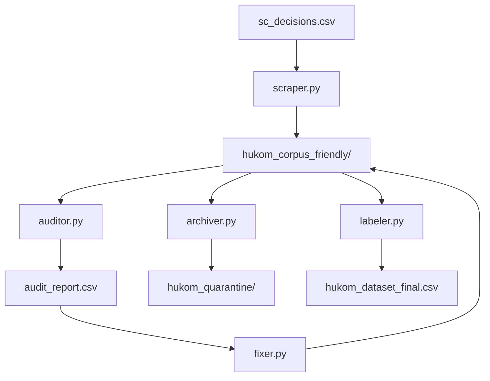

# Hukom-AI: Data Pipeline (ETL) Documentation

This document provides a comprehensive overview of the **Extract, Transform, and Load (ETL)** pipeline used to create the Hukom-AI corpus.

## Pipeline Overview

The pipeline follows a sequential flow from raw data acquisition to a structured, labeled dataset ready for model training.



---

## Phase 1: Extraction & Initial Transformation
**Script:** `src/data/scraper.py`

*   **Input:** `sc_decisions.csv` (contains metadata and URLs to the SC E-Library).
*   **Action:**
    1.  **URL Switching:** Automatically replaces standard links with "Printer Friendly" versions to reduce HTML noise.
    2.  **Scraping:** Fetches content with a 2-second rate limit (politeness).
    3.  **The "Guillotine":** Removes headers (names of petitioners/respondents) to prevent data leakage.
    4.  **Semantic Splitting:** Uses a regex-based "Semantic Splitter" to separate text into `FACTS` and `RULING`.
    5.  **Noise Reduction:** Strips footnotes, citations, and Supreme Court signatures.
*   **Output:** `hukom_corpus_friendly/` (Individual `.txt` files).

---

## Phase 2: Quality Assurance (Auditing)
**Script:** `src/data/auditor.py`

*   **Input:** `hukom_corpus_friendly/*.txt`
*   **Action:** Algorithmically scans for:
    *   **Split Failures:** Files missing the `SPLIT_SUCCESS` flag.
    *   **Header Residue:** Fragments of "Republic of the Philippines" or justice names appearing early.
    *   **Caps Lock Headers:** Detecting if the guillotine failed to cut uppercase headers.
    *   **Ghost Files:** Identifying placeholder files generated by the CMS (often <1KB).
*   **Output:** `audit_report.csv` (Flags problematic files for fixing or removal).

---

## Phase 3: Healing & Refactoring
**Scripts:** `src/data/fixer.py`, `src/data/refetcher.py`, `src/data/rescue_mission.py`

*   **Input:** `hukom_corpus_friendly/` + `audit_report.csv`
*   **Action:**
    *   `fixer.py`: Re-runs the extraction logic with more aggressive parameters on flagged files.
    *   `refetcher.py`: Specifically targets files that were incomplete or required a fresh download.
    *   `rescue_mission.py`: Handles complex edge cases identified during the audit.
*   **Goal:** Maximize the yield of "Clean" files.

---

## Phase 4: Archiving
**Script:** `src/data/archiver.py`

*   **Input:** `hukom_corpus_friendly/` + `audit_report.csv`
*   **Action:** Moves persistently problematic files that cannot be algorithmically fixed from the main corpus to a separate directory.
*   **Output:** `hukom_quarantine/` (Bad files excluded from training).

---

## Phase 5: Labeling & Final Export (Load)
**Script:** `src/data/labeler.py`

*   **Input:** `hukom_corpus_friendly/` (Clean files only).
*   **Action:**
    1.  **Keyword Extraction:** Analyzes the `RULING` section for specific legal outcomes.
    2.  **Classification:**
        *   `Label 1`: Prosecution Win / Affirmation / Liability.
        *   `Label 0`: Defense Win / Reversal / Nullification.
        *   `Label 2`: Modification (Partially granted/denied).
        *   `Label 3`: Remand / Moot / Other.
*   **Output:** `hukom_dataset_final.csv` (The training-ready dataset).

---

## How to Run

To rebuild or update the dataset, execute scripts in the following order:

```bash
# 1. Scrape data
python3 src/data/scraper.py

# 2. Audit for issues
python3 src/data/auditor.py

# 3. Fix issues (repeat audit/fix as needed)
python3 src/data/fixer.py

# 4. Quarantine unfixable files
python3 src/data/archiver.py

# 5. Generate final labeled dataset
python3 src/data/labeler.py
```
